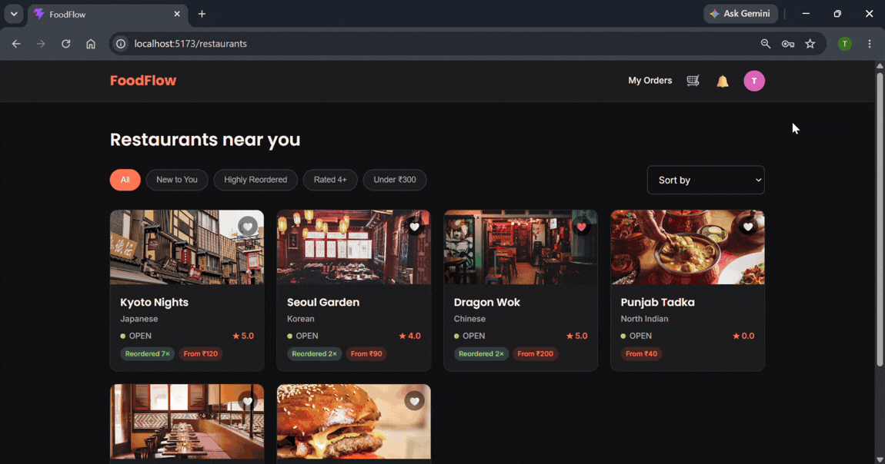
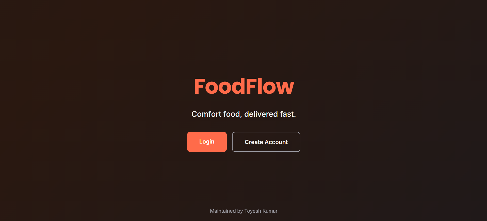
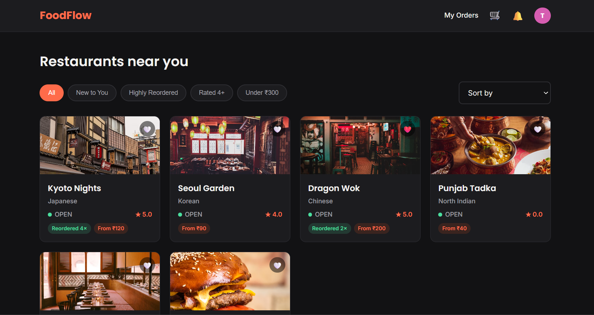
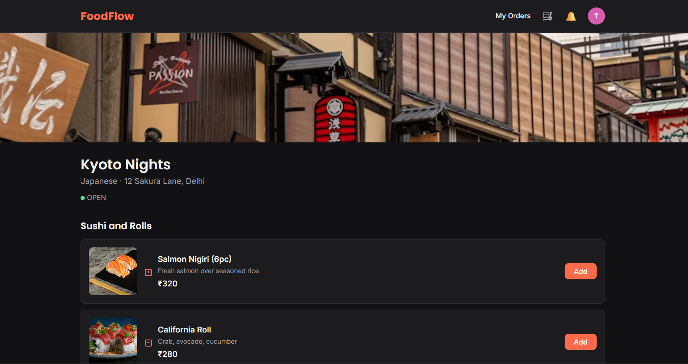
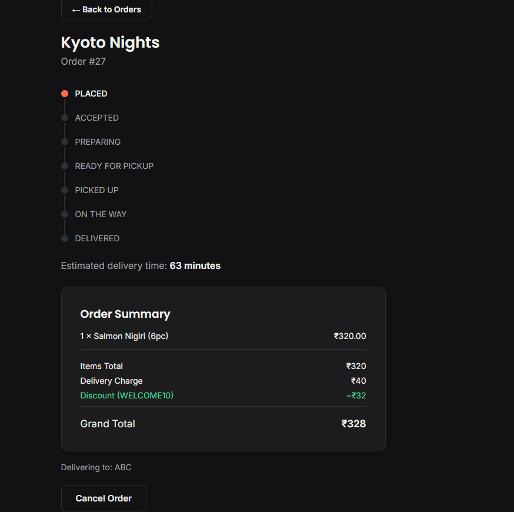
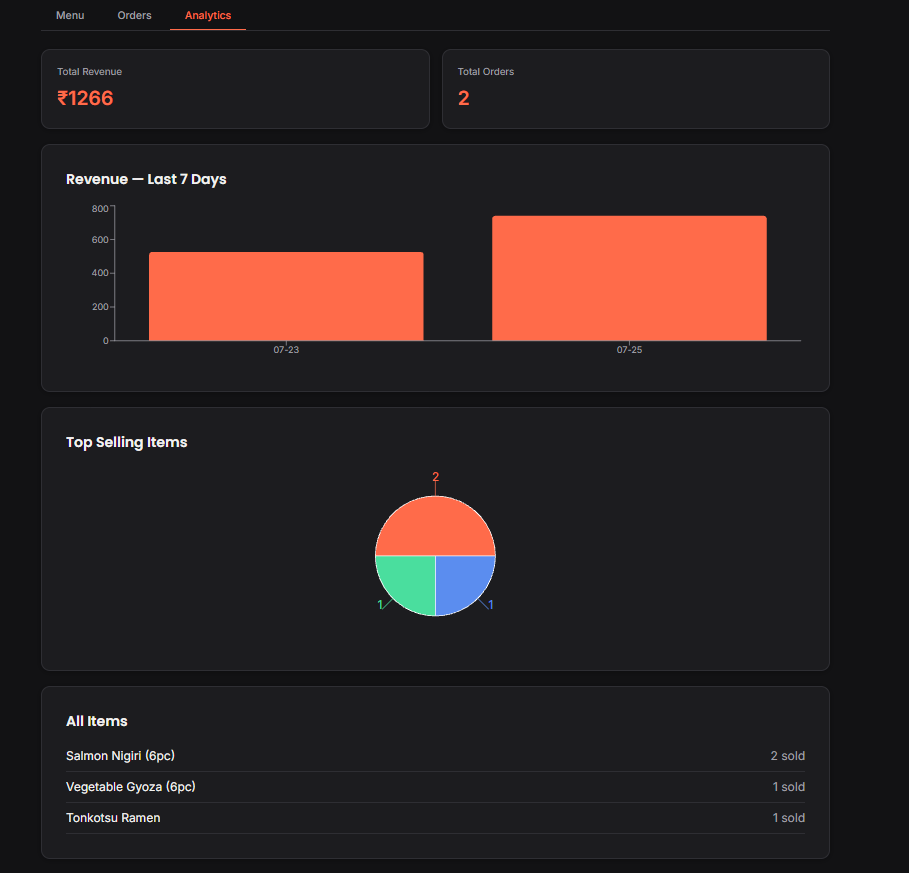
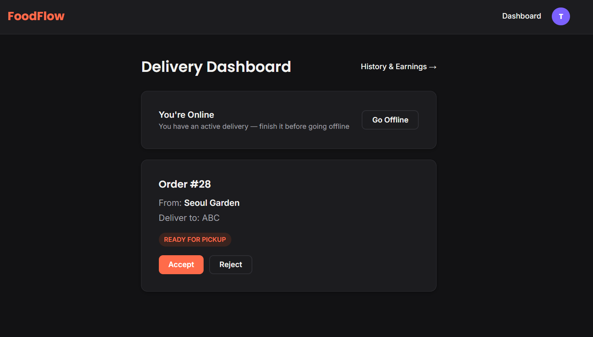
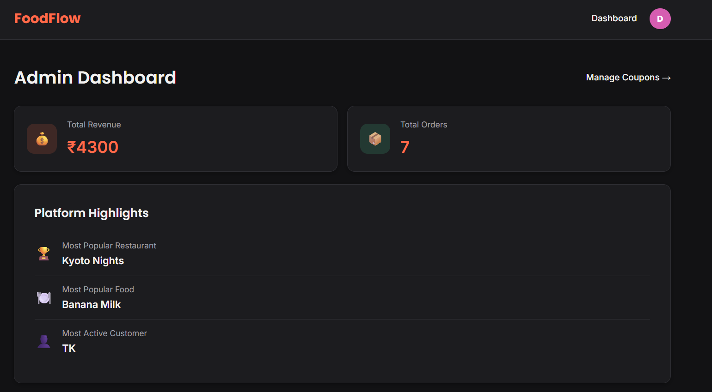
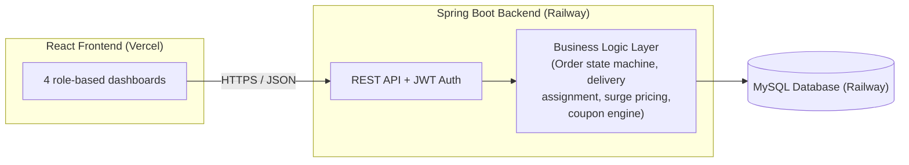

# FoodFlow

A full-stack food delivery platform simulation — inspired by Swiggy/Zomato — built solo from scratch with Java, Spring Boot, and React. Every core system a real delivery platform needs: order lifecycle management, distance-based delivery assignment, dynamic surge pricing, a rule-based coupon engine, and role-specific dashboards for customers, restaurant owners, delivery agents, and admins.


**Live app:** https://foodflow-hazel.vercel.app

**API docs (Swagger):** https://foodflow-production-a866.up.railway.app/swagger-ui.html

---

## Screenshots



| Welcome | Browse Restaurants | Menu |
|---|---|---|
|  |  |  |

| Order Tracking | Owner Analytics | Delivery Dashboard | Admin |
|---|---|---|---|
|  |  |  |  |

---

## Features

**Customer**
- Browse restaurants with filters (New to You, Highly Reordered, Rated 4+, Under ₹300) and sorting
- Cart, checkout with coupon codes, and a full simulated payment flow (UPI/Card/COD/Wallet)
- Live order tracking with a visual status timeline
- Ratings and reviews (restaurant, food item, delivery agent) with auto-updating averages
- Real-time notifications for every order milestone
- Favorites ("My Collection") and auto-populated "Liked Dishes"

**Restaurant Owner**
- Multi-restaurant management, live status control (Open/Closed/Busy/Holiday)
- Menu builder with categories, veg/non-veg tagging, availability toggling
- Incoming order pipeline with accept/reject/prepare workflow
- Analytics dashboard with revenue and top-item charts

**Delivery Agent**
- Online/offline toggle with automatic nearest-agent assignment
- Accept/reject assigned deliveries, live status updates
- Earnings tracking and delivery history with charts

**Admin**
- Platform-wide analytics (revenue, most popular restaurant/food, most active customer)
- Coupon management (percentage/flat discounts, expiry, usage limits, min bill, restaurant-scoped)

---

## Architecture



Order lifecycle is enforced through an explicit state machine (`PLACED -> ACCEPTED -> PREPARING -> READY_FOR_PICKUP -> PICKED_UP -> ON_THE_WAY -> DELIVERED`), with role-based transition rules.

Delivery assignment uses the Haversine formula to find the nearest available online agent, with automatic retry logic if no agent was available at the first attempt.

---

## Tech Stack

**Backend:** Java 21, Spring Boot 3, Spring Security (JWT), Spring Data JPA, MySQL, Maven, Swagger/OpenAPI, JUnit 5 + Mockito

**Frontend:** React 18, Vite, React Router, Axios, Recharts

**Deployment:** Vercel (frontend), Railway (backend + database)

---

## Try It Yourself

**Live app:** https://foodflow-hazel.vercel.app

Use these demo credentials to jump straight in - or register your own account (customer, owner, and agent roles are self-serve):

| Role | Email | Password |
|---|---|---|
| Customer | `demo.customer@foodflow.com` | `demo1234` |
| Restaurant Owner | `owner2@test.com` | `owner123` |
| Delivery Agent | `demo.agent@foodflow.com` | `demo1234` |
| Admin | `demo.admin@foodflow.com` | `demo1234` |

The owner account comes pre-loaded with 6 branded restaurants and full menus — a good starting point to explore the owner dashboard.

---

## Running Locally

Prerequisites: Java 21, Node.js, MySQL 8

```bash
# Backend
cd foodflow
# Set DB_PASSWORD environment variable to your MySQL password first
mvn spring-boot:run

# Frontend (separate terminal)
cd foodflow-frontend
npm install
npm run dev
```

Visit `http://localhost:5173`. API docs at `http://localhost:8080/swagger-ui.html`.

---

## Known Limitations

This is a portfolio/demo project, not a production payment system:
- Payments are simulated - no real payment gateway is integrated; card/UPI fields are collected for realism but never transmitted or stored.
- Images are stock/placeholder photos, not real per-dish photography (no upload infrastructure yet).
- Not hardened for production traffic - no rate limiting, no email verification, minimal input sanitization beyond basic validation.
- Distance calculation uses straight-line (Haversine) distance, not real road routing.
- The live demo is hosted on Railway's free tier - it may experience brief cold-start delays after periods of inactivity, and the deployment may go offline if the free tier credit runs out. If the live link is unavailable, the project can be run locally using the instructions above.

---

## Project Stats

Built end-to-end by a single developer across 7 backend and 8 frontend phases, culminating in deployment. Backed by 50+ GitHub commits and a complete pull request history

---

## About

Owned and maintained by Toyesh Kumar. Built as a learning project to go deep on real backend systems design and a complete React frontend, from zero prior experience with either Spring Boot or React.

Feedback, issues, and pull requests are welcome. Feel free to open an issue if you spot a bug or have a suggestion. 

GitHub: https://github.com/toyeshkumar06/foodflow
